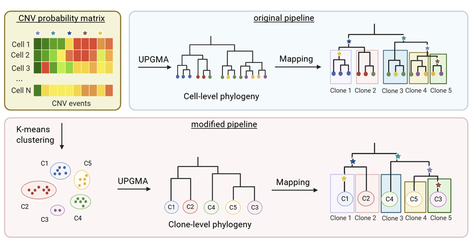

# Enhancing Numbat for Scalable Copy Number Variation Inference and Robust Subclonal Detection from Single-Cell RNA Sequencing Data
Haoyu Cheng, 12/10/2025

Submitted in partial fulfillment of the requirements for Research Honors in the Degree of Master of Science in Computational Biology, Carnegie Mellon University

## Abstract:
Copy number variations (CNVs) are key drivers of genomic instability in cancer and are central
to characterizing tumor heterogeneity. Single-cell RNA sequencing (scRNA-seq) enables
CNV inference at single-cell resolution, and numerous computational tools have been developed
for this purpose. Among them, Numbat has consistently outperformed other methods
in both CNV detection and tumor-cell classification across multiple benchmarking studies.
However, it can struggle to resolve subclonal structure in some datasets, and its high computational
cost further restricts its scalability to large cohorts.

To address these limitations, we systematically analyzed Numbat’s computational bottlenecks
and introduced several efficiency-oriented algorithmic improvements. We replaced
its original hierarchical clustering procedure with a hybrid hierarchical K-means strategy
to construct cluster-level phylogenies, and we modified ScisTree, the maximum-likelihood
phylogeny method used by Numbat, to directly map CNV events onto these phylogenies,
thereby determining the subclonal structure. With these modifications, runtime complexity
decreases from approximately quadratic to linear, and memory requirements are reduced
by more than 80%. In parallel, the improved pipeline achieves lineage-inference and CNVinference
accuracy comparable to the original implementation across 14 diverse real samples.
Collectively, these enhancements provide a more scalable, efficient, and similarly accurate
approach for subclonal CNV inference from scRNA-seq data, supporting large-scale tumor
analyses and emerging applications in personalized and translational cancer research.

## Workflow:

  

## Acknowledgments & Code Attribution

This work builds upon:

- **Gao et al., *Haplotype-aware analysis of somatic copy number variations from single-cell transcriptomes***  
  Nature Biotechnology (2022)  
  https://www.nature.com/articles/s41587-022-01468-y

- Original implementation: https://github.com/kharchenkolab/numbat

Parts of this repository are adapted from the original codebase. We extend it with improvements in computational efficiency and scalability.

We thank the original authors for making their method and code publicly available.
